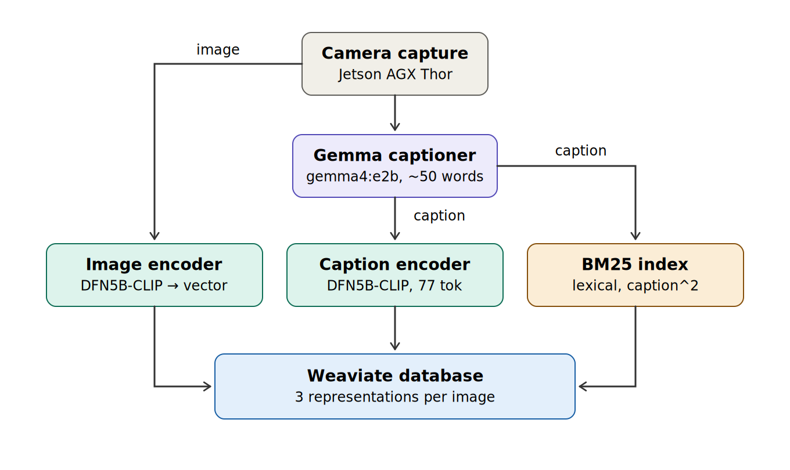
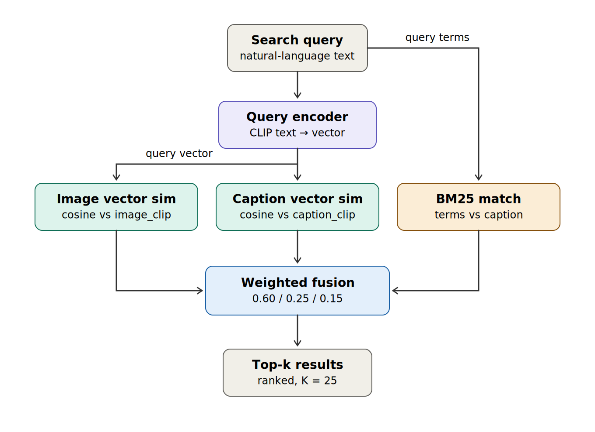
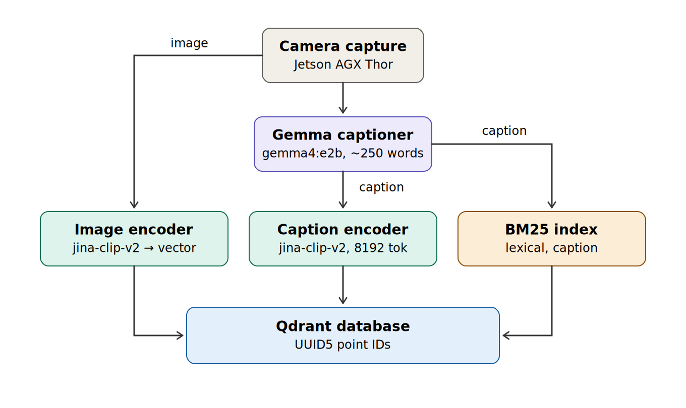
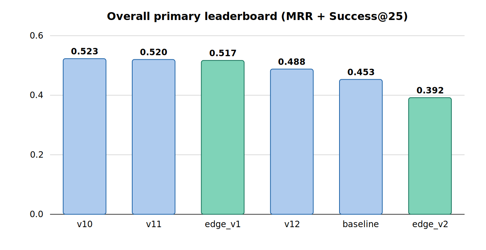
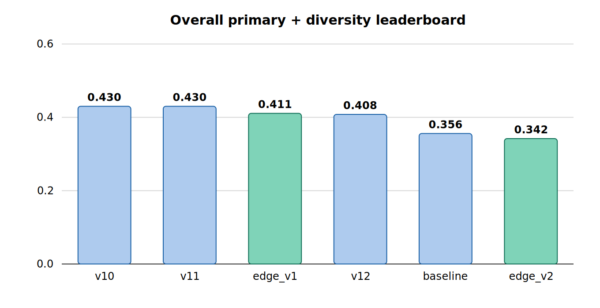

# Image Search at the Edge

*Sage Grande: Summer of AI 2026*

Image Search at the Edge is an offline-first, multimodal image-search system that runs
entirely on single **NVIDIA Jetson AGX Thor**. Every image is stored as several
independent representations — an image vector, a caption vector, and a lexical index — and
every query is scored against each and fused into a single ranked list. All model and
database work happens on the device, with no runtime internet dependency.

## Ingestion — building the index

The raw image feeds two branches in parallel: a CLIP image encoder (the image vector) and a
local vision-language captioner. The generated caption then feeds its own two branches: a
CLIP text encoder (the caption vector) and a BM25 lexical index. All three representations
land in the vector database, keyed to the same image.

## Search — querying and fusion

The query splits the same way the image did. The encoded query vector drives cosine
similarity against both the image vector and the caption vector, while the raw query terms
drive the BM25 lexical leg. Each leg is normalized independently, then combined with fixed
fusion weights. The top results come straight out of the fused score.

## A newer configuration: long captions

A later configuration keeps the same three-leg shape but lifts a key constraint. The
earlier CLIP text encoder capped captions at 77 tokens, which forced a hard tradeoff:
detailed captions were too long to embed (reachable only through keyword matching), so
captions had to be shrunk to fit — embeddable, but thin. Switching to a long-context
embedder (**jina-clip-v2**, 8192 tokens) removes that ceiling, so the caption can grow to
~250 words *and* be embedded. Captioner "thinking" is turned off since it consumed the
token budget for no measurable gain, and storage moves to **Qdrant**.

## Configurations at a glance

| | Baseline | Dual-embedding | Long-caption |
|---|---|---|---|
| Caption model | `gemma-3-4b-it` | `gemma4:e2b`, thinking on | `gemma4:e2b`, thinking off |
| Caption length | ~150 words | ~50 words | ~250 words |
| Embedder | DFN5B-CLIP (77 tok) | DFN5B-CLIP (77 tok) | jina-clip-v2 (8192 tok) |
| Vectors stored | image only | image + caption | image + caption |
| Fusion | 75% image + 25% BM25 | 60% image + 25% caption + 15% BM25 | image + caption + BM25 |
| Database | Weaviate | Weaviate | Qdrant |

Color key for the diagrams: gray = source/output, purple = neural model, teal = CLIP vector
operations, amber = BM25 lexical, blue = storage/fusion.

## How it performs

Across five public image-search benchmarks, the edge system is compared against a set of
datacenter reference systems on a single composite score. Edge configurations are shown in
teal.

Despite running fully on-device, the edge baseline ranks **3rd of 6** on the primary
composite (0.517, within ~0.006 of the top reference systems) and posts the **highest
Success@25 of any system (0.697)** — it most reliably surfaces a relevant image in the top
results. Its lower MRR, from having no reranker, is what keeps it just behind the two
leaders.

Source code and configuration are available in the
[project repository](https://github.com/10sajan10/sage-image-search-edge-app).
