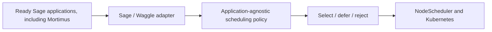

# Resilient Urgent Scheduling for Sage

**Authors:** Dave MacDonald ([UC Davis](https://ucdavis.edu)), Sean Huang ([University of Chicago](https://uchicago.edu)), Clément Nunes ([Inria](https://inria.fr)), and Morty

Urgent computing aims to produce a useful result before that result loses its
value. A correct decision delivered after its operational deadline can be as
unhelpful as a wrong decision.

This project adds an explainable urgent-computing scheduling policy for edge
applications. It decides which ready application should start next, checks
whether it can start safely, and explains the decision. The decision engine is
application-agnostic; Mortimus is the concrete integration target used here to
explain and validate it.

The implementation is available in the
[scheduler source repository](https://github.com/NunesClement/sage-resilient-urgent-scheduler).

## The problem

Sage nodes run multiple applications on limited edge hardware. Routine work and
time-sensitive events may compete for the same CPU, memory, GPU, and execution
slots while priorities and deadlines change.

Mortimus makes this problem concrete. Routine landscape observation may wait,
but a possible smoke event makes timely inference more valuable. The scheduling
policy must answer three questions:

1. Which ready application should start next?
2. Can it start without exceeding safe limits?
3. Why was each application selected, deferred, or rejected?

## Project goal

The goal is not to build a policy that works only for Mortimus. It is to provide
a reusable urgent-computing scheduling policy at Sage's ready-application
selection point.

The scheduling policy is designed to:

- favor deadline-sensitive work while using queue age to reduce starvation;
- enforce configured concurrency and trusted resource limits;
- return deterministic decisions with a reason for every candidate;
- continue with a bounded queue-order fallback if the main policy fails;
- remain reusable across applications and testable without a live cluster.

Sage remains the platform orchestrator. The scheduling policy changes only
which ready application is selected inside its existing workflow; it does not
replace Beehive, WES, Kubernetes, or the `NodeScheduler` controller's
responsibilities. Deployment may still package that controller in a replacement
binary or image.

## How the scheduling policy fits into Sage



The Sage adapter converts ready and active Waggle runtimes into generic task
data. The scheduling policy returns explained decisions, the existing
`NodeScheduler` creates Pods, and Kubernetes places and runs them. Another
controller can reuse the decision engine through its own adapter.

The current Sage adapter implements Waggle's Go scheduling-policy interface and
is compiled into this repository's replacement `waggle-nodescheduler` binary.
Upstream Waggle's `policy` argument selects a policy registered in its compiled
binary. This repository instead injects its adapter and accepts only
`-policy resilient-urgent`; neither path dynamically loads a Python script. A
policy written in Python or another language would therefore need a compiled
bridge or another explicit process boundary.

A Kubernetes Scheduling Framework plugin or a separate Kubernetes scheduler is
another possible implementation direction. It operates one level lower,
filtering and scoring nodes for Pods after Sage has selected an application.
The current project keeps urgent application selection in Waggle's
`NodeScheduler` and leaves Pod placement to the configured Kubernetes
scheduler.

## Mortimus integration target

Mortimus is a Sage application for a field-vision scenario. Cameras observe a
remote landscape, inference runs close to the data, and the wider system can
publish a compact result instead of continuously moving full-resolution
imagery.

The two scenes illustrate the operational change that creates urgency:

| Routine landscape observation | Possible smoke event |
|---|---|
|  |  |

**In urgent computing, the right result delivered too late is the wrong result.**

*These are project-context images, not policy output or evaluation results.*

The scheduling policy does not detect smoke or choose an AI model. When Sage
makes the Mortimus application ready, the policy can rank and admit it like any
other Sage workload. The repository prepares this integration boundary, but it
does not contain an end-to-end Mortimus deployment.

The wider Mortimus concept connects the cameras, local inference on a Sage
Thor node, the scheduler, a low-bandwidth Meshtastic path, and optional Beehive
publication:


*Conceptual system context. Solid lines represent physically linked components;
dotted lines represent distant request or image exchange.*

In this design, the scheduling policy remains application-agnostic. The
companion [Sage Meshtastic project](https://github.com/dMac716/sage-dev-meshtastic)
explores the low-bandwidth control and verdict path rather than embedding that
transport in the scheduling policy.

The repository also includes an optional paired-camera core for a primary and
an additional HaLow image source. It correlates the captures and validates
time, pose, size, and transfer integrity before calling an injected analyzer.
This is an optional application feature, not a scheduling-policy requirement.
Camera drivers, MQTT/Meshtastic adapters, storage, AI models, and Beehive
publication remain separate integration work.

## Concepts in more detail

| Term | Meaning in this project |
|---|---|
| **Intent** | The desired result, without prescribing how to obtain it. |
| **Policy** | The explicit rules used to rank ready applications and decide which may start. |
| **Admission** | The checks that enforce concurrency and trusted resource limits. |
| **Selected** | Valid work admitted to start now. |
| **Deferred** | Valid work that remains queued because it cannot start now. |
| **Rejected** | Invalid or ineligible work. |
| **Fail-open** | A bounded queue-order decision fallback used only when the main policy fails. |

The optional `intentctl` feature converts natural language into a small,
reviewable Sage science-goal draft. It always requires human approval and does
not select plugins, assign priority, submit jobs, or bypass the policy.

Urgency is represented through deadline slack:

```text
slack = deadline - current time - estimated runtime
```

Negative slack means that an on-time finish is already unlikely. The wider
urgent-computing problem may also involve data movement, network conditions,
energy, cost, and result quality. The current policy is narrower: it uses
priority, slack, queue age, a provided success-probability estimate, and bounded
resource information.

## How the policy decides

1. **Observe and validate** ready and active tasks.
2. **Rank** valid tasks using priority, deadline slack, queue age, and provided
   success probability.
3. **Admit** tasks within total/GPU concurrency limits and, when trustworthy
   capacity exists, CPU/memory/GPU limits.
4. **Explain** every selection, deferral, or rejection with a stable reason.
5. **Degrade safely** to bounded FIFO if the engine fails and fail-open is
   enabled.

Fail-open preserves basic scheduling continuity. It is not retry, migration,
checkpoint recovery, or automatic model switching.

## Implemented components

| Component | Current role |
|---|---|
| Policy engine | Deterministic ranking, admission, and explained decisions. |
| Sage/Waggle adapter and `waggle-nodescheduler` | Inject the policy into the existing Sage scheduler. |
| `policyctl` | Validate configuration and replay queue snapshots offline. |
| `chaoslab` | Measure sensitivity to controlled input changes; it does not inject live failures. |
| `intentctl` | Produce a strict, human-reviewed Sage science-goal draft. |

The included replay shows the intended behavior: an urgent `smoke-detector`
with negative slack is selected, while a routine `image-sampler` is deferred by
the concurrency limit and remains eligible to run later.

## Current status and next validation

The policy engine is tested offline and the Sage integration is prepared, but
it has not been deployed on a Sage node. Resource fitting remains off by
default until Sage supplies trustworthy capacity data, and upstream queue
identity and snapshot issues must be resolved before deployment.

The validation direction is policy replay, KWOK control-plane scenarios, k3s
execution tests, Sage shadow mode, and then a controlled Mortimus deployment.

## Artifacts of accomplishments

- [Project explanation PDF](https://github.com/NunesClement/sage-summer-camp-2026/blob/main/orchestrator/output/pdf/sage-resilient-urgent-scheduler-explanation.pdf)
- [Repository guide PDF](https://github.com/NunesClement/sage-summer-camp-2026/blob/main/orchestrator/output/pdf/sage-resilient-urgent-scheduler-repository-guide.pdf)
- [Chaos sensitivity experiment](https://github.com/NunesClement/sage-summer-camp-2026/blob/main/orchestrator/examples/chaos/sensitivity.json)
- [Classroom notes and workshop tutorial](https://github.com/NunesClement/sage-summer-camp-2026/blob/main/classroom-notes.md)

## Sources and research directions

The first group documents the interfaces and test tools used by the repository.
The remaining papers motivate the design or identify research directions. A
citation does not mean that prediction, preemption, migration, model adaptation,
or edge-to-cloud reconfiguration is implemented here.

### Current interfaces and validation

| Source | Use in this project |
|---|---|
| [Waggle edge-scheduler](https://github.com/waggle-sensor/edge-scheduler), the pinned [NodeScheduler policy interface](https://github.com/waggle-sensor/edge-scheduler/tree/5391a00b34fa069f14b4ce50153725571007b5ef/pkg/nodescheduler/policy), and its upstream [`policy` selector](https://github.com/waggle-sensor/edge-scheduler/blob/5391a00b34fa069f14b4ce50153725571007b5ef/cmd/nodescheduler/main.go#L46) | This is the implemented integration seam. Upstream selects a registered, compiled Go policy. This repository's replacement binary compiles and injects its adapter and accepts only `-policy resilient-urgent`; other languages require an explicit bridge. |
| [Kubernetes Scheduler](https://kubernetes.io/docs/concepts/scheduling-eviction/kube-scheduler/) and its [Scheduling Framework](https://kubernetes.io/docs/concepts/scheduling-eviction/scheduling-framework/) | Kubernetes filters feasible nodes and scores them using configured plugins and constraints. A custom plugin or separate scheduler is a possible alternative, but the current scheduling policy acts earlier, when Sage selects an application. |
| [KWOK](https://kwok.sigs.k8s.io/) and its [scheduling test scenarios](https://kwok.sigs.k8s.io/docs/examples/scheduling/) | KWOK can exercise Kubernetes objects, placement rules, priority, and control-plane transitions at scale. It does not run the real containers or validate inference latency, GPU behavior, sensors, networks, or physical failures. |

### Research foundations

| Publication | Why it matters here |
|---|---|
| Leong and Kranzlmüller, [*Towards a General Definition of Urgent Computing* (2015)](https://doi.org/10.1016/j.procs.2015.05.402) | Grounds the central requirement: computation must start promptly and finish before its result can no longer support mitigation. |
| Dazzi et al., [*Urgent Edge Computing* (2024)](https://doi.org/10.1145/3659994.3660315) | Connects urgent computing with sensing at the edge, heterogeneous resources, latency, availability, and decentralization. |
| Kim et al., [*Goal-driven scheduling model in edge computing for smart city applications* (2022)](https://doi.org/10.1016/j.jpdc.2022.04.024) | The closest Sage foundation: science goals, context-aware decisions, and a two-layer cloud/edge scheduling model. |
| Kim et al., [*Towards Adaptive Resource Management and Control on Edge Platform for AI Applications* (2023)](https://doi.org/10.5281/zenodo.10311026) | Motivates a generic application–scheduler contract in which applications expose metrics and control points without placing application logic inside the scheduler. |
| Collis et al., [*Introducing Sage: Cyberinfrastructure for Sensing at the Edge* (2020)](https://doi.org/10.5194/egusphere-egu2020-12320) | Provides the Sage platform context: multi-tenant, multi-task sensing, edge machine learning, and early wildfire detection among the motivating workloads. |
| Balouek-Thomert, Rodero, and Parashar, [*Harnessing the Computing Continuum for Urgent Science* (2020)](https://doi.org/10.1145/3439602.3439618) | Frames time-critical scientific workflows across edge and cloud resources; it informs the wider direction beyond this node-level scheduling policy. |
| Balouek-Thomert, Rodero, and Parashar, [*Evaluating Policy-Driven Adaptation on the Edge-to-Cloud Continuum* (2021)](https://doi.org/10.1109/UrgentHPC54802.2021.00007) | Supports explicit policies and trade-offs among deadlines, resources, response time, and result quality. The current implementation ranks and admits tasks; it does not reconfigure the continuum. |
| Čyras et al., [*Argumentation for Explainable Scheduling* (2019)](https://doi.org/10.1609/aaai.v33i01.33012752) | Reinforces the need to explain scheduling decisions. This project emits deterministic reason codes; it does not implement the paper's argumentation framework. |

## Learn more

Full source, architecture docs, and replay data are available in the
[project repository](https://github.com/NunesClement/sage-summer-camp-2026).
