# SageAir Intelligence

## From Visible Atmosphere to Actionable Intelligence on Sage Nodes

> **Research question:** Can images of the surrounding environment help a machine classify local air conditions as healthy or unhealthy?

SageAir Intelligence explores whether ground-level camera imagery, combined with nearby air-quality and meteorological observations, can provide a qualitative, confidence-aware indication of unhealthy air. The project is designed as a complementary screening capability for places where reference-grade monitoring is sparse—not as a replacement for calibrated regulatory instruments.

<p align="center">
  
</p>

*Figure 1. Claude Monet, **Houses of Parliament, London** (1900–1901), Art Institute of Chicago. The painting provides a visual prologue to the long history of atmosphere altering colour, contrast, and visibility.*

## From visible atmosphere to machine-readable evidence

Air pollution is often invisible as a chemical exposure, but its effects on the atmosphere can become strikingly visible. Haze can obscure buildings, smoke can change the colour of the sky, and suspended particles can reduce the distance over which objects remain distinguishable. Monet's view of London shows that atmospheric visibility has shaped human perception for more than a century.

More recently, Canadian wildfire smoke transformed New York City in June 2023, covering the skyline in an orange-brown haze. In July 2026, smoke again reduced visibility and produced unhealthy-to-hazardous air-quality conditions across Chicago. These scenes connect different periods and places through one recurring observation: **changes in the atmosphere leave visual evidence**.

<p align="center">
  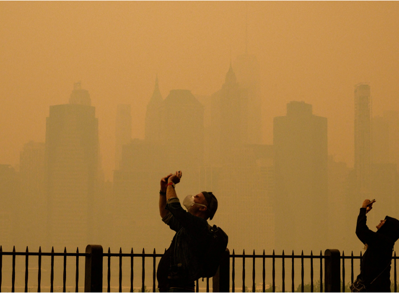
</p>

*Figure 2. Canadian wildfire smoke over New York City on 7 June 2023, sharply reducing visibility and increasing surface-level particulate pollution. Source: NBC New York.*

<p align="center">
  
</p>

*Figure 3. Canadian wildfire smoke obscures the Chicago skyline during the July 2026 smoke episode. Source: CNN.*

## Why this matters

The World Health Organization estimates that, in 2019, **99% of the global population** lived in places where its air-quality guideline levels were not met. Ambient air pollution was associated with approximately **4.2 million premature deaths** in that year, with **89% of those deaths occurring in low- and middle-income countries**. Exposure contributes to cardiovascular and respiratory disease, acute lower-respiratory infections, and lung cancer.

The burden is also unevenly distributed. UNICEF estimated in 2016 that approximately **300 million children** lived in areas where outdoor air pollution exceeded international guideline levels by at least sixfold. OECD projections indicate that, without adequate action, outdoor air pollution could cause between six million and nine million premature deaths annually by 2060 and impose economic losses of approximately 1% of global GDP.

Despite this burden, air-quality observations remain spatially uneven. Reference-grade monitoring stations provide essential quantitative measurements, but they cannot be installed at every neighbourhood, school, transport corridor, industrial boundary, rural settlement, or wildfire-affected location. SageAir is intended to help identify places and periods that may require further measurement, investigation, or communication.

## Potential stakeholders

| Stakeholder | Potential use of SageAir |
|---|---|
| Atmospheric and computer scientists | Identify events, compare images with PM2.5 and meteorology, and study model transfer |
| Environmental regulators | Prioritise inspections and deployment of calibrated monitors |
| Public-health departments | Support local risk communication and exposure-reduction planning |
| Emergency-management agencies | Improve situational awareness during wildfire-smoke and dust events |
| Municipal and regional planners | Identify repeatedly affected areas and environmental inequalities |
| Schools, hospitals, and outdoor workplaces | Inform validated protocols for outdoor activity |
| Community organisations and residents | Receive accessible, place-specific warnings and supporting context |
| Wildfire and land-management teams | Detect smoke episodes and support targeted observation |

## Measuring what we can see

SageAir uses ground-level images from fixed cameras as a complementary environmental data stream. During model development, timestamped images are paired with nearby PM2.5, AQI, and meteorological observations. A computer-vision model then learns relationships associated with atmospheric visibility, contrast, sky appearance, smoke or plume structures, and the degree to which distant objects are obscured.

The first phase frames the problem as a binary classification task with prediction confidence:

- **Good:** matched PM2.5 AQI below 151
- **Bad:** matched PM2.5 AQI of 151 or higher, corresponding to the US EPA *Unhealthy* category or worse

These labels are model-development categories. They should not be interpreted as direct clinical assessments of individual exposure.

# 1. Data Sources and Ground-Truth Construction

## Study period

| Comparatively clear conditions | Smoke-affected conditions |
|---|---|
| 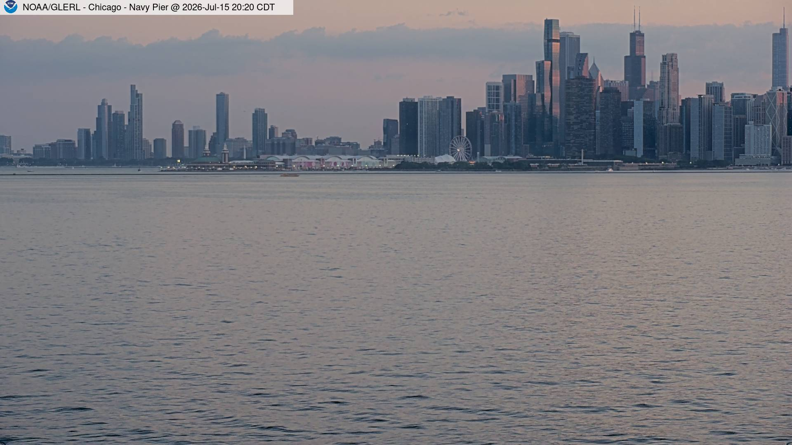 | 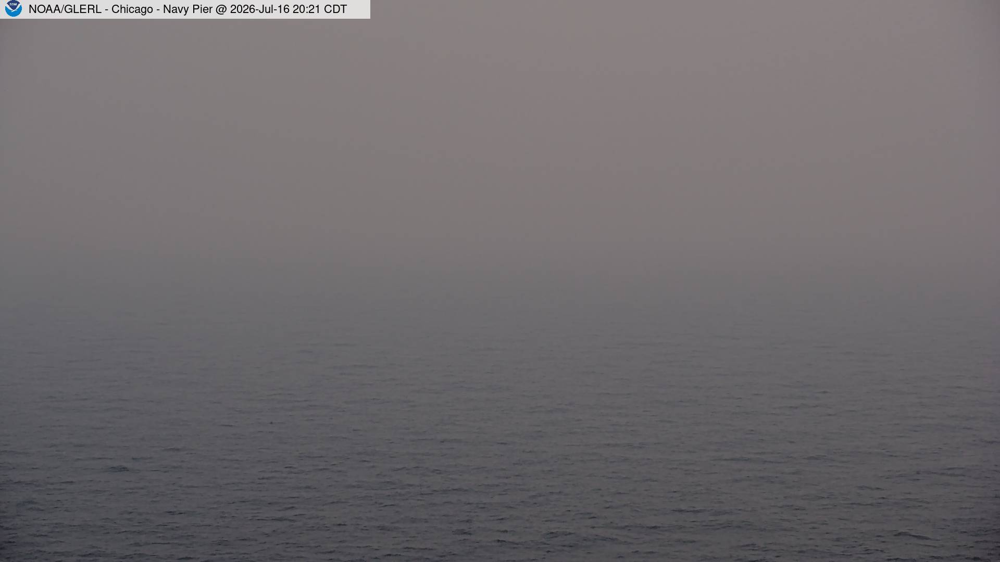 |

*Figure 4. Example Chicago camera views showing the visual contrast between comparatively clear and smoke-affected conditions during the study window.*

The dataset covers **14 days, from 11 July to 24 July 2026**. This window includes the severe Chicago air-pollution episode between **16 July and 19 July 2026**, providing both comparatively clear and highly polluted conditions for model development and evaluation.

The period captures visual changes in visibility, contrast, sky appearance, haze intensity, and the obscuration of distant objects.

## Camera image data

<p align="center">
  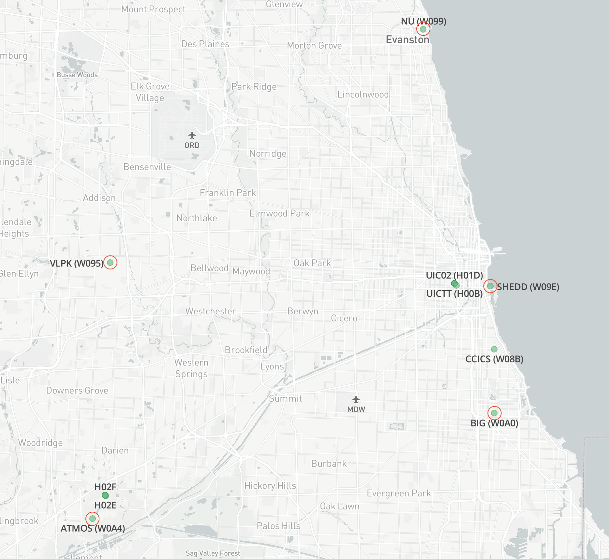
</p>

*Figure 5. Geographic distribution of the NIREM Sage nodes used for image collection.*

Ground-level images were collected from cameras deployed across five nodes in the **NIREM Sage node group**:

- `W0A4`
- `W09E`
- `W095`
- `W0A0`
- `W099`

All available camera images from these nodes during the study period were considered for inclusion. The use of multiple nodes introduced different locations, viewing directions, backgrounds, and environmental contexts.

This multi-camera structure is important because a model may otherwise learn camera-specific features—such as buildings, vegetation, lighting, or skyline characteristics—rather than transferable indicators of degraded air quality.

## Reference air-quality data

The onboard PM2.5 measurements from the Sage nodes were deemed insufficiently reliable to serve as the primary ground-truth source. External reference observations were therefore obtained through the **PurpleAir API**.

For each Sage camera location, geographically proximate PurpleAir stations were identified. Measurements from the nearest available stations were used to represent ambient conditions around the corresponding node. PurpleAir observations were interpreted using the **US EPA Air Quality Index framework**.

## Outlier-resistant ground-truth estimation

Low-cost sensor measurements can be affected by temporary sensor errors, localised emission sources, humidity, drift, or anomalous readings. To reduce the influence of isolated outliers, the ground-truth value was calculated as the **median of the selected PurpleAir measurements** for the relevant location and observation period.

The resulting ground-truth pipeline was:

```text
Sage camera image
        ↓
Nearest PurpleAir stations
        ↓
US EPA PM2.5 AQI values
        ↓
Median aggregation
        ↓
Reference good/bad label
```

This is an initial development and feasibility dataset, not a definitive regulatory air-quality record. Geographic proximity does not guarantee identical conditions at the camera and reference station. Future evaluation should therefore test sensitivity to station distance, temporal alignment, meteorological conditions, correction methods, and alternative aggregation strategies.

# 2. Data Processing and Dataset Construction

<p align="center">
  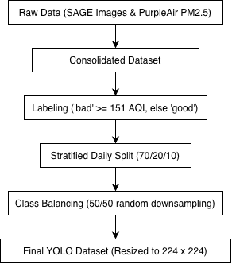
</p>

*Figure 6. Data-processing workflow from raw Sage imagery and PurpleAir observations to the final balanced YOLO dataset.*

## Image labelling

Each camera image was temporally matched with the corresponding aggregated PurpleAir observation. The resulting US EPA PM2.5 AQI was used to assign a binary label:

- **Bad:** AQI >= 151
- **Good:** AQI < 151

```text
Timestamped Sage image
        ↓
Matched PurpleAir observations
        ↓
Median PM2.5 AQI
        ↓
Binary good/bad label
```

## Date- and label-stratified splitting

The labelled dataset was grouped by both observation date and air-quality label, then split approximately **70:20:10** into training, validation, and test subsets. Every observation date was represented across all three splits.

| Dataset split | Images | Proportion |
|---|---:|---:|
| Training | 554 | 69.6% |
| Validation | 158 | 19.8% |
| Test | 84 | 10.6% |
| **Total** | **796** | **100%** |

The training set was used to optimise model parameters. The validation set supported model selection and overfitting checks. The test set was retained for final evaluation.

## Class balancing

The original class distribution was unequal. To prevent the model from favouring the majority class, balancing was performed independently within each split. The majority class was randomly downsampled until each subset contained:

> **50% good images / 50% bad images**

Minority-class images were not duplicated or synthetically generated. For reproducibility, the random seed and image identifiers assigned to each split should be retained.

## Data-leakage considerations

Every date was intentionally represented across all three subsets. Images recorded close together in time may therefore remain visually similar because they share the same camera view, lighting, weather, and pollution episode. The reported image-only result should be interpreted as performance on held-out images from the same observation period and network—not as fully independent geographic or temporal generalisation.

Future experiments should include:

- leave-one-node-out evaluation;
- complete date or event holdouts;
- future-period and seasonal testing;
- evaluation on geographically separate Sage node groups; and
- analyses that control for camera-specific backgrounds.

# 3. Operational Pipeline

<p align="center">
  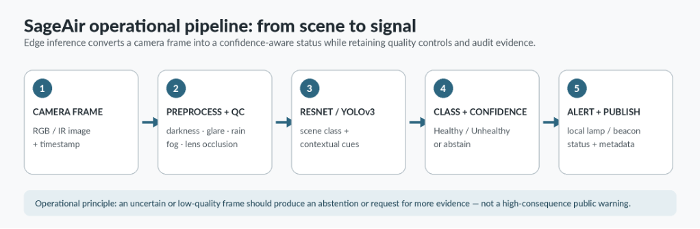
</p>

*Figure 7. Proposed SageAir operational pipeline: capture, quality control, inference, confidence-aware classification, and alert publication.*

The operational workflow is:

1. **Camera frame:** acquire RGB or infrared imagery with timestamp metadata.
2. **Preprocessing and quality control:** check darkness, glare, rain, fog, blur, and lens obstruction.
3. **Inference:** apply the selected image-only or multimodal model.
4. **Class and confidence:** output good, bad, or abstain when evidence is insufficient.
5. **Alert and publish:** publish the status, confidence, model version, quality state, and supporting metadata.

An uncertain or low-quality frame should produce an abstention or request for more evidence—not a high-consequence public warning.

# 4. Image-Only Model: Training and Results

## Model architecture

The binary image classifier used the **YOLO classification framework**, initialised from pretrained `yolo26s-cls.pt` weights. Each camera image produced a predicted class and associated confidence score.

## Training configuration

| Parameter | Configuration |
|---|---|
| Model | YOLO classification |
| Initial weights | `yolo26s-cls.pt` |
| Input resolution | 224 x 224 pixels |
| Maximum epochs | 200 |
| Batch size | 8 |
| Number of classes | 2 |
| Output classes | Good and Bad |

## Test-set performance

The selected model was evaluated on the balanced test set of **84 images**. It correctly classified **79 images**, giving an overall accuracy of **0.94**.

| Evaluation measure | Result |
|---|---:|
| Test-set size | 84 images |
| Correct predictions | 79 images |
| Overall accuracy | **0.94** |

<p align="center">
  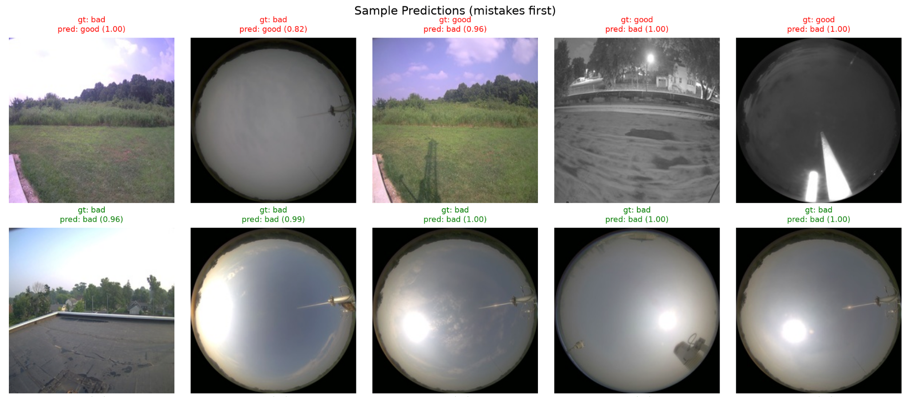
</p>

*Figure 8. Example image-only predictions, with misclassified cases displayed first.*

<p align="center">
  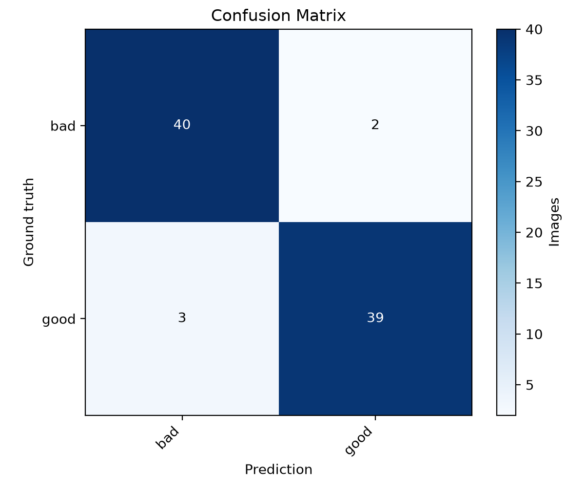
</p>

*Figure 9. Image-only confusion matrix: 40 bad images and 39 good images were classified correctly; two bad images were classified as good, and three good images were classified as bad.*

The result demonstrates promising proof-of-concept performance within the available Chicago dataset. It does not yet establish generalisability to unseen nodes, new cities, different seasons, different camera hardware, or pollution sources other than the July 2026 smoke episode.

For a public-health screening application, the **false-negative rate for the bad class** is especially important because a false negative would classify an unhealthy condition as good.

# 5. Multimodal Model: Training and Results

## Model architecture

The multimodal classifier used a two-branch fusion architecture that combined:

- a camera image; and
- concurrent temperature, humidity, and pressure readings.

A ResNet50 image encoder and a small multilayer perceptron for meteorological variables produced separate feature vectors, which were concatenated and passed to a fully connected classification head.

## Training configuration

| Parameter | Configuration |
|---|---|
| Model | ResNet50 multimodal fusion |
| Initial weights | ImageNet |
| Input resolution | 224 x 224 pixels |
| Maximum epochs | 30 |
| Batch size | 32 |
| Number of classes | 2 |
| Output classes | Good and Bad |

Training-time image augmentation included random crop, horizontal flip, rotation, colour jitter, Gaussian blur, synthetic haze overlay, and random erasing. Meteorological variables were standardised using a scaler fitted only on the training data.

<p align="center">
  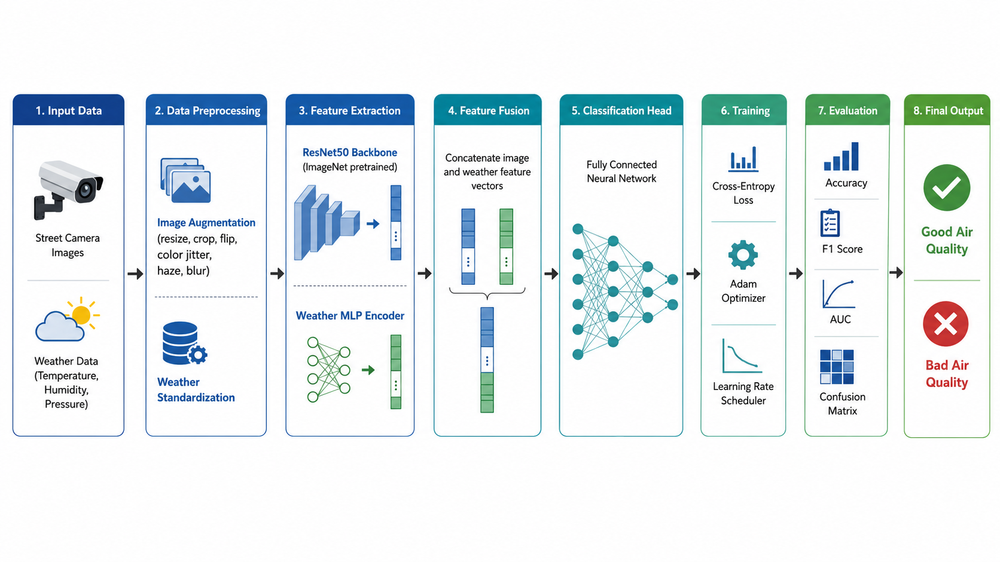
</p>

*Figure 10. Multimodal training pipeline combining camera imagery and weather observations. The figure was produced as a conceptual aid and should be aligned with the final implementation before publication.*

The pipeline comprised:

1. **Input data:** paired camera image and weather readings.
2. **Preprocessing:** image augmentation and training-only weather standardisation.
3. **Feature extraction:** ResNet50 image encoder and weather MLP.
4. **Feature fusion:** concatenation of image and weather representations.
5. **Classification head:** fully connected binary classifier.
6. **Training:** cross-entropy loss, Adam optimisation, and validation-based learning-rate scheduling.
7. **Evaluation:** accuracy, F1, AUC, and confusion matrix.
8. **Output:** good or bad air-quality class with confidence.

## Test-set performance

The multimodal model correctly classified **76 of 84 images** in the node-held-out test set.

| Evaluation measure | Result |
|---|---:|
| Test-set size | 84 images |
| Correct predictions | 76 images |
| Accuracy | **0.905** |
| F1 score | **0.907** |
| AUC | **0.955** |

<p align="center">
  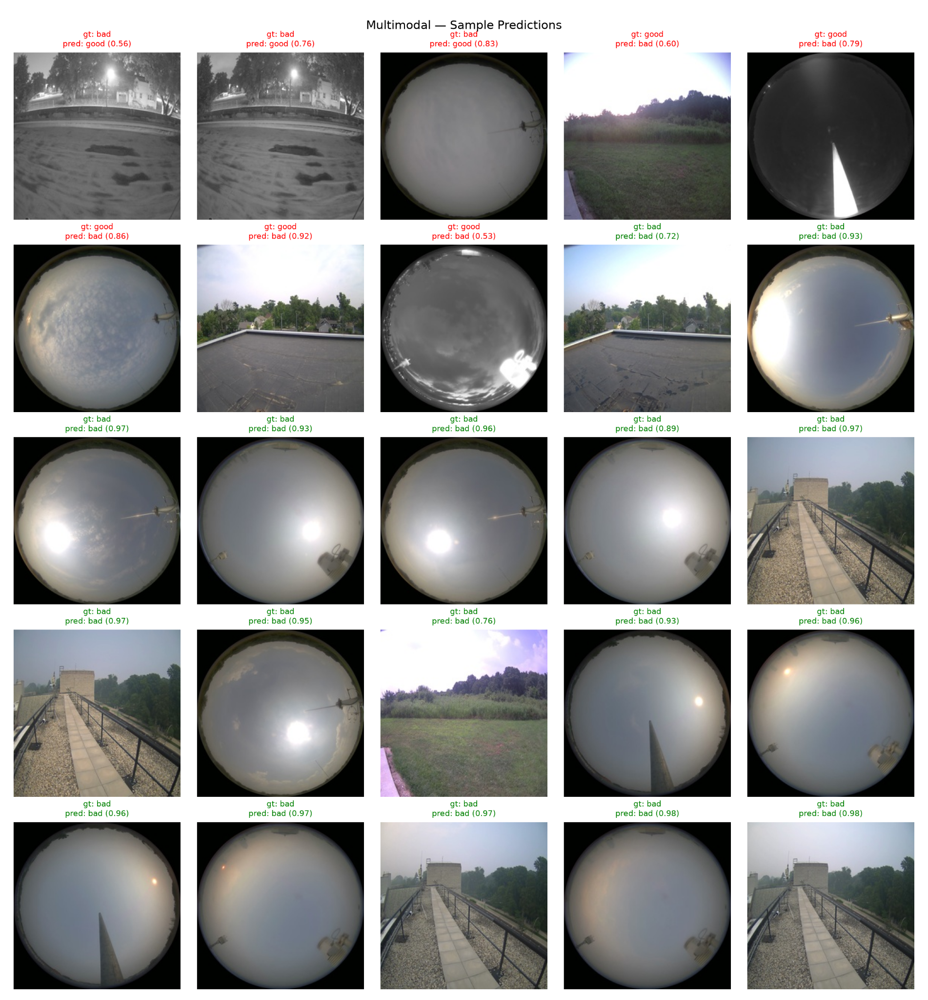
</p>

*Figure 11. Example multimodal predictions, with mistakes displayed first.*

<p align="center">
  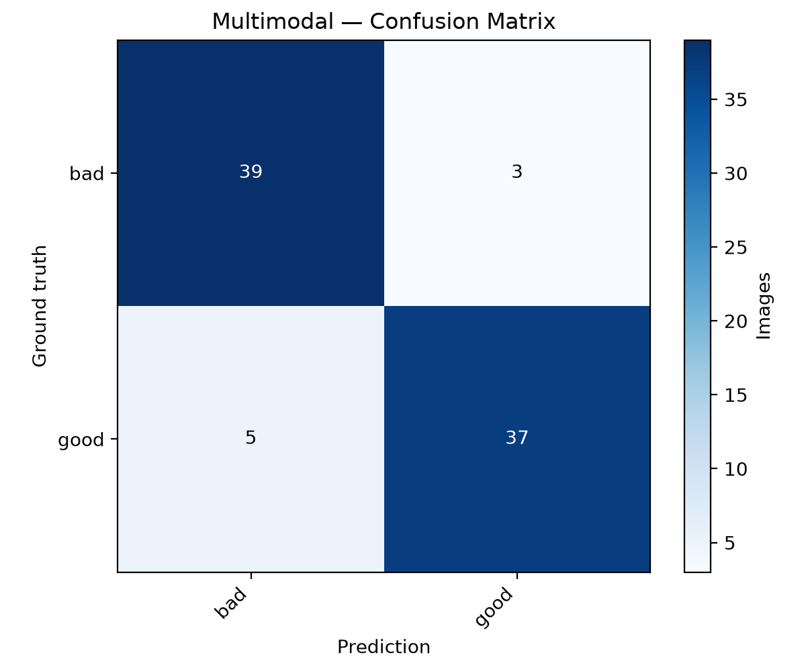
</p>

*Figure 12. Multimodal confusion matrix: 39 bad and 37 good images were classified correctly; three bad images were classified as good, and five good images were classified as bad.*

The node-held-out design provides stronger evidence of camera-location generalisation than a random same-node image split. However, pressure-sensitivity analysis suggested that the model may rely strongly on barometric pressure. The result should therefore not yet be attributed to improved visual air-quality detection without further ablation and validation.

# 6. Challenges and Discussion

## Limited training data

The current dataset spans only 14 days and five Chicago-area nodes. Although it includes comparatively clear conditions and a major wildfire-smoke episode, it does not capture the full range of seasons, pollution sources, weather patterns, camera types, and environments expected in long-term deployment.

The small sample increases the risk that the models learn July 2026-specific patterns rather than generalisable visual indicators. Particular backgrounds, skylines, lighting conditions, or smoke-event characteristics may become shortcuts for the bad class. Temporally adjacent frames may also be highly similar, reducing the effective diversity of the dataset.

Random downsampling helped prevent majority-class bias but excluded valid observations from the more common class. Current performance should therefore be interpreted as an initial proof of concept.

Future datasets should cover additional nodes, seasons, cities, camera types, pollution episodes, and AQI categories. Evaluation should prioritise leave-one-node-out, leave-one-event-out, and future-period testing.

## Environmental and visual variability

Outdoor images are affected by factors other than pollution. Time of day, cloud cover, shadows, sunrise, sunset, exposure settings, rain, fog, snow, humidity, dust, lens contamination, glare, and water droplets can all alter visibility and contrast. These conditions can imitate pollution-related haze. Conversely, high particulate concentrations may not be visually obvious when a camera has limited sky or horizon coverage.

The five cameras also capture different proportions of sky, vegetation, buildings, roads, and horizon features. Some use wide-angle or fisheye views, while others are narrow or partially obstructed. A model may therefore learn camera identity instead of transferable atmospheric cues.

Controls required before operational deployment include:

- image-quality checks for darkness, glare, rain, fog, blur, obstruction, and missing frames;
- separate analyses for day, night, clear weather, fog, rain, and smoke;
- sky-only, horizon-only, and full-scene ablations;
- realistic environmental augmentation;
- camera-specific and camera-independent validation;
- confidence thresholds and an abstention class; and
- integration of humidity, temperature, pressure, wind speed, and wind direction.

Contextual variables also require careful interpretation. A multimodal model may obtain high performance by relying on a variable correlated with a single event rather than learning a transferable relationship. Feature ablation, sensitivity testing, and explainability analysis are therefore essential.

## Implications for interpretation

The findings show that images and contextual environmental observations contain promising information for binary air-quality classification within the available Chicago dataset. SageAir should, however, be described as an **experimental, confidence-aware screening system**, not a replacement for calibrated monitoring.

Predictions may help identify locations or periods requiring further measurement and investigation. Public alerts should not be triggered from a single image without quality checks, supporting evidence, temporal persistence, and appropriate validation.

# 7. Next Steps and Future Work

## AGU26 abstract submission

The immediate goal is to present the completed proof-of-concept work, data alignment, binary classification results, uncertainty handling, and edge-computing workflow. Multi-node operational deployment should be described as future work.

**Submission deadline:** 5 August 2026, 23:59 EDT / 22:59 CDT in Chicago.

| Priority | AGU26 session | Proposed positioning |
|---|---|---|
| Primary — A010 | Advances in Methods and Technologies for Emission Monitoring and Exposure Assessment to Hazardous Air Pollutants | Frame SageAir as a new monitoring and exposure-screening method; do not claim source-specific emission quantification without evidence. |
| Secondary — A034 | Air Pollution and Well-Being: Bridging Surface, Space, and Modelling Studies | Emphasise integration of surface imagery, meteorology, sensors, and public-health decision support. |
| Conditional — A087 | Low-cost Air Quality Sensors: Challenges, Opportunities, and Collaborative Strategies across the World | Emphasise scalable complementary edge monitoring, validation, calibration, deployment constraints, and collaboration with conventional sensors. |

## Sage Edge Code Repository application

The next engineering milestone is a versioned, auditable Sage Edge application.

- **Inputs and camera control:** named camera, inference interval, crop or region of interest, model path, threshold policy, and optional meteorological stream.
- **Packaging:** `Dockerfile`, dependencies, `sage.yaml`, `README`, model card, `ecr-meta/ecr-science-description.md`, 512 x 512 icon, and at least 1920 x 1080 science image.
- **Testing:** unit tests, sample images, deterministic preprocessing tests, container smoke tests, and an integration test confirming that published measurements can be queried from Sage.
- **Deployment access:** confirm node-owner permission, camera names, sensor inventory, scheduling rights, and data-use constraints before selecting NIREM or another pilot group.

## Multi-camera dashboard and historical visualisation

<p align="center">
  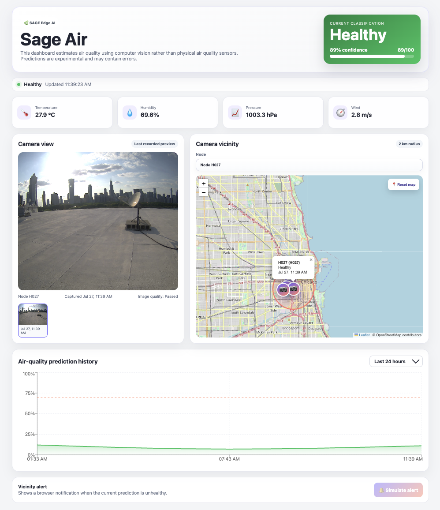
</p>

*Figure 13. Dashboard concept showing the latest prediction, camera view, map-based node selection, meteorological context, historical predictions, and vicinity alerts.*

The dashboard should:

- support multiple camera nodes;
- display current and historical predictions;
- show confidence, data quality, model version, and data age;
- allow users to select an individual camera directly from the map;
- incorporate wind direction and wind speed;
- provide vicinity-based push notifications within a validated range around nodes; and
- suppress alerts when image quality or model confidence is inadequate.

## Standalone study building on AQuaMoHo

A standalone paper can build on the group's AQuaMoHo framework, which inferred localised AQI labels from a low-cost thermo-hygrometer and publicly available spatiotemporal context. The proposed comparative question is:

> **Does computer vision provide reliable incremental information for air-quality class prediction beyond low-cost meteorology and contextual variables, particularly where dense reference monitoring is unavailable?**

Recommended study design:

- **Primary evaluation:** leave-one-node-out and event-held-out testing.
- **Model comparison:** image-only, meteorology-only, contextual baseline, and multimodal fusion.
- **Metrics:** balanced accuracy, precision, recall, F1, AUROC or AUPRC, confusion matrices, and class-specific error rates.
- **Stratified analysis:** day/night, season, smoke, fog, rain, and camera view.
- **Ablations:** sky-only, horizon/visibility landmarks, full scene, colour/contrast, meteorology, pressure, and temporal context.
- **Interpretation:** report where vision helps, where it duplicates contextual variables, and where it fails. A rigorous negative or conditional result remains scientifically valuable.

# References

1. World Health Organization. [Ambient (outdoor) air pollution](https://www.who.int/news-room/fact-sheets/detail/ambient-(outdoor)-air-quality-and-health). Fact sheet, updated 24 October 2024.
2. OECD. [Environment and health](https://www.oecd.org/en/publications/health-at-a-glance-2025_8f9e3f98-en/full-report/environment-and-health_9e5f6c4c.html). *Health at a Glance 2025*, published 13 November 2025.
3. UNICEF. [Clear the Air for Children](https://www.unicef.org/reports/clean-air-children). October 2016.
4. Art Institute of Chicago. [Claude Monet, *Houses of Parliament, London*, 1900–1901](https://www.artic.edu/artworks/16584/houses-of-parliament-london). CC0 public-domain designation.
5. National Weather Service Chicago. [Air Quality Alert relayed 17 July 2026](https://forecast.weather.gov/product.php?format=CI&glossary=1&issuedby=LOT&product=AQA&site=BOX&version=7).
6. Sage Continuum. [Sage: A distributed software-defined sensor network](https://sagecontinuum.org/docs/about/overview).
7. Sage Continuum. [Application-Agnostic Dynamic Data Collection for AI on the Edge](https://sagecontinuum.org/science/2025/dynamic-data-collection).
8. Pramanik, P. et al. [AQuaMoHo: Localized Low-Cost Outdoor Air Quality Sensing over a Thermo-Hygrometer](https://doi.org/10.1145/3580279). *ACM Transactions on Sensor Networks* 19(3), Article 69, 2023.

## Important use note

SageAir outputs should be treated as qualitative screening signals. Operational alerts require validated thresholds, persistent evidence across time, explicit image-quality controls, confidence calibration, and comparison with established air-quality observations.
